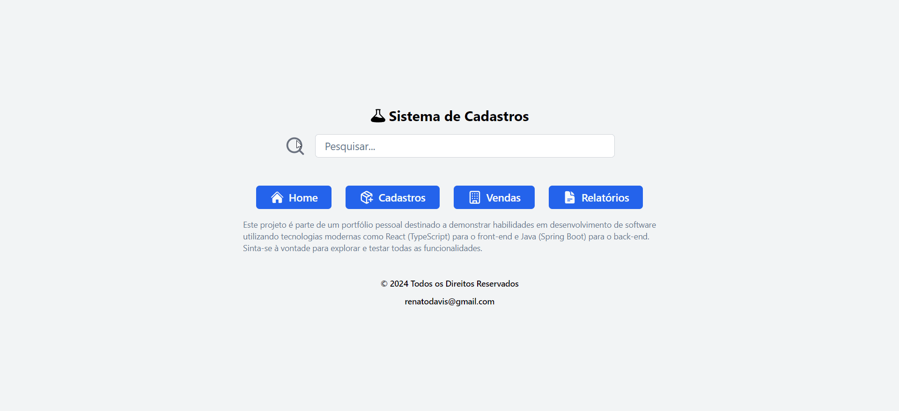

# Projeto de Portfólio Pessoal

Este projeto é parte de um portfólio pessoal destinado a demonstrar habilidades em desenvolvimento de software utilizando tecnologias modernas como React (TypeScript) para o front-end e Java (Spring Boot) para o back-end. Sinta-se à vontade para explorar e testar todas as funcionalidades.

## Tecnologias Utilizadas

- **Front-end:** React (TypeScript)
- **Back-end:** Java (Spring Boot)
- **Banco de Dados:** (MySQL)

## Funcionalidades

- Cadastro de clientes ( consulta, filtro ) 
- Cadastro de produtos ( em desenvolvimento )
- Pedido de venda ( em desenvolvimento )
...

## Demonstração



## Repositórios

- [Front-end](https://github.com/renatodavis/front-end-react)
- [Back-end](https://github.com/renatodavis/springboot)

## Como Executar o Projeto

### Pré-requisitos

- NPM ou Yarn
- JDK 8+
- Maven

### Passos para Executar

1. Clone os repositórios:

    ```bash
    git clone https://github.com/renatodavis/front-end-react.git
    git clone https://github.com/renatodavis/springboot.git
    ```

2. Navegue até o diretório do front-end e instale as dependências:

    ```bash
    cd front-end-react
    npm install
    # ou
    yarn install
    ```

3. Inicie o servidor do front-end:

    ```bash
    npm start
    # ou
    yarn start
    ```

4. Navegue até o diretório do back-end e compile o projeto:

    ```bash
    cd ../springboot
    mvn clean install
    ```

5. Inicie o servidor do back-end:

    ```bash
    mvn spring-boot:run
    ```

## Licença

Este projeto está licenciado sob a Licença MIT. Veja o arquivo [LICENSE](LICENSE) para mais detalhes.

## Contato

Para mais informações, entre em contato através do email: renatodavis@gmail.com
